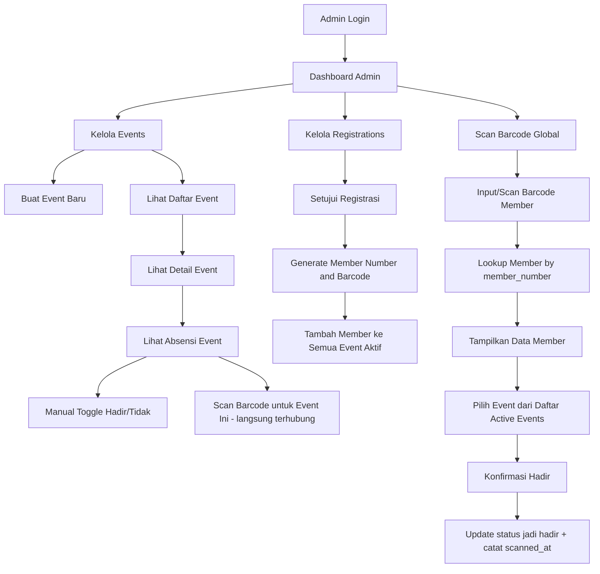

# Sistem Absensi Acara - Architectural Plan

## Ringkasan

Sistem absensi untuk acara-acara AMG Owners Surabaya. Admin dapat membuat acara, mengelola absensi member secara manual maupun via scan barcode. Setiap member (registration) yang telah disetujui akan mendapatkan barcode unik berdasarkan auto-increment ID yang diubah menjadi nomor member.

---

## 1. Database Schema

### 1.1 Tabel `events`

| Column       | Type         | Keterangan                                  |
|-------------|-------------|---------------------------------------------|
| id          | bigint AI PK | Primary key                                 |
| title       | string(255)  | Nama acara                                  |
| description | text|null    | Deskripsi acara                             |
| event_date  | datetime     | Tanggal & waktu acara                       |
| location    | string(255) null | Lokasi acara                           |
| status      | enum         | `upcoming`, `ongoing`, `completed`, `cancelled` |
| timestamps  | -            | created_at, updated_at                      |

### 1.2 Tabel `event_attendances`

| Column          | Type         | Keterangan                                      |
|----------------|-------------|-------------------------------------------------|
| id             | bigint AI PK | Primary key                                      |
| event_id       | bigint FK    | Relasi ke `events.id` (onDelete: cascade)        |
| registration_id| bigint FK    | Relasi ke `registrations.id` (onDelete: cascade) |
| status         | enum         | `hadir`, `tidak_hadir` — default: `tidak_hadir` |
| scanned_at     | datetime null | Waktu scan barcode                               |
| timestamps     | -            | created_at, updated_at                           |

**Unique constraint:** `(event_id, registration_id)` — satu member hanya satu baris per acara.

### 1.3 Modifikasi Tabel `registrations`

Tambahkan kolom:

| Column        | Type         | Keterangan                                       |
|--------------|-------------|--------------------------------------------------|
| member_number| string(20) unique null | Nomor member unik, di-generate dari ID |

Kolom `member_number` bersifat nullable karena diisi setelah admin menyetujui registrasi (membership_status → Approved).

**Format nomor member:** `AMG` + `str_pad(id, 5, '0', STR_PAD_LEFT)`

Contoh: ID=1 → `AMG00001`, ID=123 → `AMG00123`

---

## 2. Barcode Logic

### 2.1 Teknologi Barcode

Gunakan **[`picqer/php-barcode-generator`](https://github.com/picqer/php-barcode-generator)** (install via Composer) untuk generate barcode dalam format **Code 128** yang di-encode dari `member_number`.

**Alasan memilih Code 128:**
- Mendukung alfanumerik
- Density tinggi (compact)
- Didukung semua scanner barcode

### 2.2 Alur Generate Barcode

1. Admin menyetujui registrasi (ubah `membership_status` → `Approved`)
2. System generate `member_number` dari auto-increment ID
3. System simpan `member_number` ke kolom `registrations.member_number`
4. Barcode image di-generate on-demand (tidak perlu disimpan di storage) menggunakan library
5. Barcode ditampilkan di halaman detail member untuk di-print atau di-screenshot

### 2.3 Format Member Number

```
AMG + 5 digit zero-padded ID
```

Contoh:
- ID 1 → `AMG00001`
- ID 45 → `AMG00045`
- ID 678 → `AMG00678`
- ID 12345 → `AMG12345`

---

## 3. Alur Sistem

### 3.1 Flowchart



### 3.2 Event Creation Flow

1. Admin klik "Buat Acara Baru"
2. Isi form: title, description, event_date, location
3. Submit → Event created with status `upcoming`
4. System otomatis insert attendance records untuk semua member dengan `membership_status = Approved` dan `member_number IS NOT NULL`
5. Attendance status default: `tidak_hadir`

### 3.3 Member Approval → Auto-add to Events

1. Admin setujui registrasi (ubah status ke `Approved`)
2. System generate `member_number` dan simpan
3. System cari semua event dengan status `upcoming` atau `ongoing`
4. System insert attendance records untuk event-event tersebut
5. Member siap untuk absensi

### 3.4 Barcode Scanning Flow — Dua Jalur

#### Jalur A: Scan dari Halaman Detail Event
1. Admin buka halaman detail event
2. Klik tombol "Scan Barcode" yang ada di halaman tersebut
3. Halaman scan terbuka dengan event_id sudah terisi sebagai hidden field
4. Admin scan barcode member
5. System langsung update status jadi `hadir` untuk event tersebut tanpa perlu pilih event lagi
6. Tampilkan konfirmasi sukses

#### Jalur B: Scan Global dari Sidebar Menu
1. Admin klik menu "Scan" di sidebar
2. Halaman scan terbuka tanpa event tertentu
3. Admin scan barcode member → input `member_number` + Enter
4. System lookup member berdasarkan `member_number`
5. Tampilkan data member (nama, nomor member, foto jika ada)
6. Di bawahnya, tampilkan daftar **active events** (upcoming / ongoing)
7. Admin pilih event yang dituju
8. Klik "Konfirmasi Hadir"
9. System update status jadi `hadir` dan catat `scanned_at`

### 3.5 Manual Attendance Management

Di halaman detail event, admin bisa:
- Melihat daftar semua member yang terdaftar
- Filter: Semua / Hadir / Tidak Hadir
- Search member by name
- Toggle status attendance secara manual via dropdown atau tombol
- Tombol "Scan Barcode untuk Event Ini" untuk akses cepat scan

### 3.6 Keamanan — Hanya Admin yang Bisa Scan

1. **Semua route events, attendance, dan scan berada di prefix `/admin/...`** yang dilindungi middleware `auth` dan `role:admin,super_admin`
2. **Member tidak punya akun login** — tabel `users` hanya berisi role `admin` dan `super_admin`, tidak ada role `member`
3. **Tidak ada public endpoint** untuk scan atau modify attendance
4. **Setiap aksi scan dicatat** dengan `scanned_at` timestamp untuk audit trail

---

## 4. Struktur File Baru / Modifikasi

### 4.1 New Files

| File | Keterangan |
|------|-----------|
| `app/Models/Event.php` | Model Event |
| `app/Models/EventAttendance.php` | Model Attendance (pivot) |
| `app/Http/Controllers/Admin/EventController.php` | CRUD Event |
| `app/Http/Controllers/Admin/AttendanceController.php` | Manajemen absensi |
| `app/Http/Controllers/Admin/ScanController.php` | Scan barcode |
| `database/migrations/xxxx_xx_xx_xxxxxx_create_events_table.php` | Migrasi tabel events |
| `database/migrations/xxxx_xx_xx_xxxxxx_create_event_attendances_table.php` | Migrasi tabel attendances |
| `database/migrations/xxxx_xx_xx_xxxxxx_add_member_number_to_registrations_table.php` | Add kolom member_number |
| `resources/views/admin/events/index.blade.php` | Daftar events |
| `resources/views/admin/events/create.blade.php` | Form create event |
| `resources/views/admin/events/show.blade.php` | Detail event + attendance list |
| `resources/views/admin/events/edit.blade.php` | Form edit event |
| `resources/views/admin/scan/index.blade.php` | Halaman scan barcode |

### 4.2 Modified Files

| File | Perubahan |
|------|----------|
| `routes/web.php` | Tambah routes untuk events, attendance, scan |
| `app/Models/Registration.php` | Tambah `member_number` ke fillable, relasi ke EventAttendance |
| `app/Http/Controllers/Admin/RegistrationController.php` | Modifikasi `update()` untuk generate member_number saat approval |
| `resources/views/layouts/admin.blade.php` | Tambah menu Events dan Scan ke sidebar |
| `resources/views/admin/dashboard.blade.php` | Tambah statistik events |
| `resources/views/admin/registrations/show.blade.php` | Tampilkan barcode member |

---

## 5. Routes yang Dibutuhkan

```php
// Events
Route::get('/events', [EventController::class, 'index'])->name('events.index');
Route::get('/events/create', [EventController::class, 'create'])->name('events.create');
Route::post('/events', [EventController::class, 'store'])->name('events.store');
Route::get('/events/{event}', [EventController::class, 'show'])->name('events.show');
Route::get('/events/{event}/edit', [EventController::class, 'edit'])->name('events.edit');
Route::put('/events/{event}', [EventController::class, 'update'])->name('events.update');
Route::delete('/events/{event}', [EventController::class, 'destroy'])->name('events.destroy');

// Attendance
Route::put('/events/{event}/attendance/{attendance}', [AttendanceController::class, 'update'])->name('attendance.update');
Route::post('/events/{event}/attendance/scan', [AttendanceController::class, 'scan'])->name('attendance.scan');

// Scan (global - pick event after scan)
Route::get('/scan', [ScanController::class, 'index'])->name('scan.index');
Route::post('/scan/lookup', [ScanController::class, 'lookup'])->name('scan.lookup');
Route::post('/scan/confirm', [ScanController::class, 'confirm'])->name('scan.confirm');
```

---

## 6. Detail Implementasi

### 6.1 Model: `Event.php`

```php
class Event extends Model
{
    protected $fillable = ['title', 'description', 'event_date', 'location', 'status'];

    protected $casts = [
        'event_date' => 'datetime',
    ];

    public function attendances()
    {
        return $this->hasMany(EventAttendance::class);
    }

    public function members()
    {
        return $this->belongsToMany(Registration::class, 'event_attendances')
            ->withPivot('status', 'scanned_at')
            ->withTimestamps();
    }
}
```

### 6.2 Model: `EventAttendance.php`

```php
class EventAttendance extends Model
{
    protected $fillable = ['event_id', 'registration_id', 'status', 'scanned_at'];

    protected $casts = [
        'scanned_at' => 'datetime',
    ];

    public function event()
    {
        return $this->belongsTo(Event::class);
    }

    public function registration()
    {
        return $this->belongsTo(Registration::class);
    }
}
```

### 6.3 Model: `Registration.php` — Modifikasi

Tambahkan ke `$fillable`:
```php
'member_number'
```

Tambahkan relasi:
```php
public function attendances()
{
    return $this->hasMany(EventAttendance::class);
}
```

### 6.4 Generate Member Number (Service / Helper)

```php
public static function generateMemberNumber($id)
{
    return 'AMG' . str_pad($id, 5, '0', STR_PAD_LEFT);
}
```

### 6.5 Barcode Render (di Blade View)

Menggunakan `picqer/php-barcode-generator`:

```php
use Picqer\Barcode\BarcodeGeneratorPNG;

$generator = new BarcodeGeneratorPNG();
$barcode = base64_encode($generator->getBarcode($memberNumber, $generator::TYPE_CODE_128));
```

Tampilkan di Blade:
```html

```

### 6.6 Logic Approval → Generate Member Number

Di `Admin/RegistrationController@update`:

```php
// Setelah validasi sukses
if ($validated['membership_status'] === 'Approved' && !$registration->member_number) {
    $registration->member_number = 'AMG' . str_pad($registration->id, 5, '0', STR_PAD_LEFT);
    $registration->save();
    
    // Auto-add to active events
    $activeEvents = Event::whereIn('status', ['upcoming', 'ongoing'])->get();
    foreach ($activeEvents as $event) {
        EventAttendance::firstOrCreate([
            'event_id' => $event->id,
            'registration_id' => $registration->id,
        ], [
            'status' => 'tidak_hadir',
        ]);
    }
}
```

### 6.7 Barcode Scan Page

Halaman scan menggunakan input field yang menerima input dari barcode scanner:

```html
<form id="scanForm" method="POST" action="/admin/scan/lookup">
    @csrf
    <input type="text" name="barcode" id="barcodeInput" 
           placeholder="Scan barcode di sini..." autofocus>
</form>
```

Barcode scanner akan mengirim `member_number` + `Enter` secara otomatis.

---

## 7. Todo List Implementasi

### Phase 1: Database & Model
- [ ] Install `picqer/php-barcode-generator` via Composer
- [ ] Buat migration `create_events_table`
- [ ] Buat migration `create_event_attendances_table`
- [ ] Buat migration `add_member_number_to_registrations_table`
- [ ] Buat model `Event`
- [ ] Buat model `EventAttendance`
- [ ] Update model `Registration` (tambah fillable, relasi, method generate)

### Phase 2: Event CRUD (Admin)
- [ ] Buat `EventController` dengan CRUD (index, create, store, show, edit, update, destroy)
- [ ] Buat view `admin/events/index.blade.php`
- [ ] Buat view `admin/events/create.blade.php`
- [ ] Buat view `admin/events/show.blade.php`
- [ ] Buat view `admin/events/edit.blade.php`
- [ ] Tambah routes events ke `routes/web.php`
- [ ] Update sidebar admin layout

### Phase 3: Attendance Auto-populate
- [ ] Implementasi logic: saat event dibuat, auto-add semua approved members
- [ ] Implementasi logic: saat member di-approve, auto-add ke active events
- [ ] Buat `AttendanceController` untuk manage attendance

### Phase 4: Barcode System
- [ ] Generate member_number saat approval registrasi
- [ ] Generate & tampilkan barcode di halaman detail member
- [ ] Buat halaman cetak barcode (optional)

### Phase 5: Scan Barcode
- [ ] Buat `ScanController` (lookup by barcode + confirm attendance)
- [ ] Buat view `admin/scan/index.blade.php`
- [ ] Integrasi scan dengan event yang dipilih
- [ ] Tambah routes scan ke `routes/web.php`

### Phase 6: Dashboard & Navigation
- [ ] Update admin sidebar (tambah Events, Scan menu)
- [ ] Update dashboard (tambah statistik events)

### Phase 7: Final Testing & Polish
- [ ] Test flow: create event → auto-populate members
- [ ] Test flow: approve member → auto-generate barcode → auto-add to events
- [ ] Test flow: scan barcode → mark attendance
- [ ] Test manual toggle attendance
- [ ] Test edge cases (cancelled events, rejected members, etc.)

---

## 8. Notes / Edge Cases

1. **Duplicate scan**: Jika barcode di-scan 2x untuk event yang sama, jangan buat duplikat — cukup update `scanned_at` jika status berubah
2. **Member belum disetujui**: Tidak memiliki `member_number`, tidak bisa di-scan
3. **Event sudah completed**: Jangan auto-add member baru ke event yang sudah selesai
4. **Event dibatalkan**: Attendance records tetap ada (tidak dihapus) untuk audit
5. **Scanner compatibility**: Code 128 didukung semua barcode scanner, format alfanumerik
6. **Format member_number**: Jika ada kebutuhan custom format di masa depan, simpan di config
