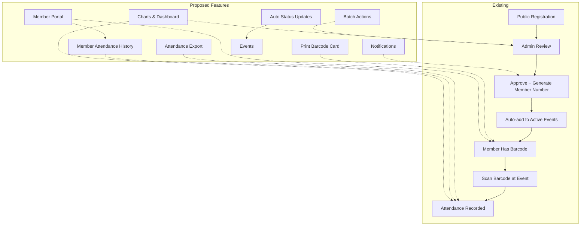

# Analisis & Proposal Fitur Tambahan — AMG Owners Surabaya

## Ringkasan Sistem Saat Ini

Sistem sudah memiliki fitur-fitur berikut:

| Fitur | Status |
|-------|--------|
| ✅ Registrasi member public (form online) | Implemented |
| ✅ Manajemen data member (CRUD, soft-delete, trash) | Implemented |
| ✅ Generate nomor member (format: AMG00001) | Implemented |
| ✅ Generate & tampilkan barcode Code 128 | Implemented |
| ✅ Export data member ke Excel | Implemented |
| ✅ Manajemen acara (CRUD) | Implemented |
| ✅ Auto-populate attendance saat buat/approve | Implemented |
| ✅ Scan barcode (manual + kamera via html5-qrcode) | Implemented |
| ✅ Manual toggle absensi (hadir/tidak hadir) | Implemented |
| ✅ Activity Logs (audit trail) | Implemented |
| ✅ CMS halaman utama (homepage) | Implemented |
| ✅ Dashboard admin dengan statistik | Implemented |
| ✅ Middleware role-based (admin/super_admin) | Implemented |
| ✅ Barcode scanner QR & Code 128 support | Implemented |

## Potensi Fitur Baru

### 🔥 Prioritas Tinggi — High Impact, Low Effort

#### 1. **Cetak Kartu Barcode Member** (Print Barcode Card)
Halaman khusus untuk mencetak kartu barcode member dengan layout yang rapi.

**File affected:**
- `resources/views/admin/registrations/print-barcode.blade.php` (new)
- `app/Http/Controllers/Admin/RegistrationController.php` (tambah method)
- `routes/web.php` (tambah route)

**User story:** Admin ingin mencetak kartu barcode untuk dibagikan ke member.

---

#### 2. **Export Absensi per Acara ke Excel** (Event Attendance Export)
Ekspor daftar hadir untuk setiap acara dalam format Excel.

**File affected:**
- `app/Exports/AttendanceExport.php` (new)
- `app/Http/Controllers/Admin/EventController.php` (tambah method export)
- `resources/views/admin/events/show.blade.php` (tambah tombol)
- `routes/web.php` (tambah route)

**User story:** Admin perlu rekap absensi acara untuk laporan atau dokumentasi.

---

#### 3. **Riwayat Absensi per Member** (Member Attendance History)
Lihat semua acara yang pernah dihadiri oleh seorang member.

**File affected:**
- `resources/views/admin/registrations/show.blade.php` (tambah section riwayat)
- Bisa view langsung di halaman detail member

**User story:** Admin ingin melihat keaktifan member dalam mengikuti acara.

---

#### 4. **Filter & Pencarian Registrasi yang Lebih Lengkap**
Tambahkan filter berdasarkan status membership, pencarian berdasarkan nomor member.

**File affected:**
- `app/Http/Controllers/Admin/RegistrationController.php`
- `resources/views/admin/registrations/index.blade.php`

**User story:** Admin perlu memfilter data member berdasarkan status (Pending/Approved/Rejected) dan mencari berdasarkan nomor member.

---

### 🔥 Prioritas Sedang — Good Value

#### 5. **Dashboard dengan Grafik & Chart**
Visualisasi data pendaftaran dan absensi dengan chart.

**File affected:**
- `resources/views/admin/dashboard.blade.php`
- Bisa pakai Chart.js (CDN)

**User story:** Admin ingin melihat tren pendaftaran dan tingkat kehadiran secara visual.

---

#### 6. **Batch Approve/Reject Registrasi**
Pilih beberapa registrasi sekaligus untuk di-approve atau di-reject.

**File affected:**
- `app/Http/Controllers/Admin/RegistrationController.php` (tambah method batch)
- `resources/views/admin/registrations/index.blade.php` (checkbox + tombol batch)
- `routes/web.php`

**User story:** Admin ingin menyetujui banyak pendaftaran sekaligus tanpa harus edit satu per satu.

---

#### 7. **Notifikasi WhatsApp/Email untuk Member Ter-approve**
Kirim pesan selamat datang ke member setelah di-approve.

**File affected:**
- `app/Notifications/MemberApproved.php` (new)
- `.env` (konfigurasi)
- `app/Http/Controllers/Admin/RegistrationController.php`

**User story:** Member ingin mendapat notifikasi bahwa pendaftarannya sudah disetujui beserta nomor member dan barcode.

---

#### 8. **Manajemen Status Acara Otomatis**
Berdasarkan tanggal acara, status otomatis berubah (upcoming → ongoing → completed).

**File affected:**
- `app/Console/Kernel.php` (scheduler)
- `app/Console/Commands/UpdateEventStatus.php` (new)

**User story:** Admin tidak perlu mengubah status acara secara manual setiap kali acara berlangsung.

---

### 🔥 Prioritas Rendah — Nice to Have

#### 9. **Member Login Portal**
Member bisa login untuk melihat data diri sendiri, barcode, dan riwayat absensi.

**File affected:**
- Migration baru untuk tabel `member_users` atau perluas `users`
- Controllers, views, routes baru
- Middleware baru

**User story:** Member ingin akses mudah ke data diri tanpa harus menghubungi admin.

---

#### 10. **Role Management untuk Admin**
Super admin bisa membuat akun admin baru dan mengelola role.

**File affected:**
- `app/Http/Controllers/Admin/UserController.php` (new)
- `resources/views/admin/users/` (new views)
- `routes/web.php`

**User story:** Super admin perlu menambah admin lain untuk membantu mengelola sistem.

---

#### 11. **Bulk Print / Download Semua Barcode**
Cetak atau download semua barcode member dalam satu halaman/PDF.

**User story:** Admin ingin menyiapkan kartu barcode untuk semua member sekaligus.

---

#### 12. **API Endpoints untuk Integrasi**
REST API untuk integrasi dengan aplikasi mobile atau sistem lain.

---

## Prioritas yang Direkomendasikan

Berdasarkan value dan effort, rekomendasi urutan implementasi:

```
Phase 1 (Segera):
  ├── [1] Cetak Kartu Barcode Member
  ├── [2] Export Absensi per Acara (Excel)
  ├── [3] Riwayat Absensi per Member
  └── [4] Filter Registrasi Lengkap

Phase 2 (Menengah):
  ├── [5] Dashboard Grafik & Chart
  ├── [6] Batch Approve/Reject
  └── [7] Notifikasi Member Approve

Phase 3 (Lanjutan):
  ├── [8] Status Acara Otomatis
  ├── [9] Member Login Portal
  └── [10] Role Management Admin
```

## Diagram Alur Sistem yang Diusulkan


