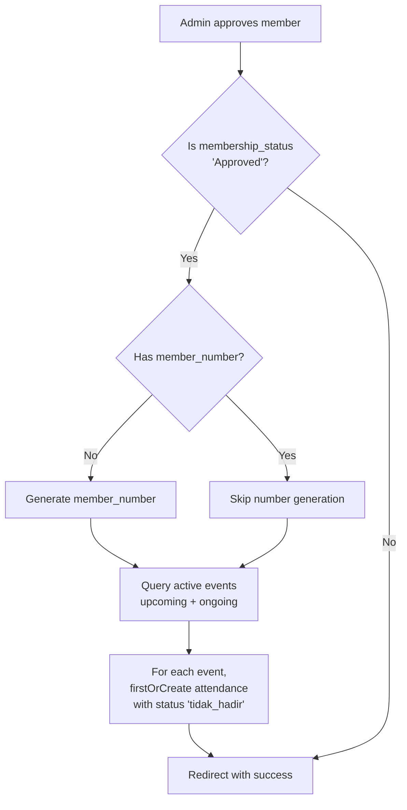

# Plan: Fix 500 Error on Event Detail Page & Auto-Add Approved Members to Attendance

## Issue 1: 500 Error on Event Detail When Member is Deleted

### Root Cause Analysis

When viewing event details (`/admin/events/{event}`), the [`EventController@show`](app/Http/Controllers/Admin/EventController.php:62-67) loads:
```php
$event->load(['attendances.registration']);
```

In the view [`show.blade.php`](resources/views/admin/events/show.blade.php:214-227), the template accesses registration properties:

| Line | Code | Issue |
|------|------|-------|
| 218 | `$attendance->registration->member_number ?? '-'` | **Safe** (null coalescing) |
| 222 | `$attendance->registration->full_name` | **Unsafe** — crashes if registration is null |
| 226 | `$attendance->registration->phone` | **Unsafe** — crashes if registration is null |

The [`Registration` model uses `SoftDeletes`](app/Models/Registration.php:6-10), so:
- **Soft-deleted** (in trash): The `belongsTo` relationship still resolves (includes soft-deleted by default), so `$attendance->registration` is NOT null — no crash.
- **Force-deleted** (permanently): The database row is gone. While `cascadeOnDelete` exists on the foreign key, **pre-existing orphaned records** (created before the foreign key constraint was added, or if the DB engine didn't enforce it) cause `$attendance->registration` to be **null**, resulting in:
  ```
  Call to a member function full_name on null
  ```
  This manifests as a **500 Server Error**.

Same unsafe access patterns exist in:
- [`AttendanceExport::map()`](app/Exports/AttendanceExport.php:39-51) — accesses `full_name`, `nickname`, `phone` without null checks
- [`AttendanceController@update()`](app/Http/Controllers/Admin/AttendanceController.php:34-36) — accesses `full_name` without null check

### Solution

1. **`EventController@show`**: Filter out orphaned attendances (where registration is null) before passing to view
2. **`show.blade.php`**: Add null coalescing to all registration property accesses as a defense-in-depth measure
3. **`AttendanceExport`**: Add null coalescing to all registration property accesses
4. **`AttendanceController@update`**: Guard against null registration before accessing its properties

---

## Issue 2: Approved Members Not Auto-Added to Attendance

### Root Cause Analysis

The auto-add logic already exists in two places:

1. [`EventController@store`](app/Http/Controllers/Admin/EventController.php:39-50): When a **new event is created**, all currently-approved members are added — ✅ **this works**

2. [`RegistrationController@update`](app/Http/Controllers/Admin/RegistrationController.php:123-147): When a single registration is **updated to Approved** — but has a flawed condition:
   ```php
   if ($validated['membership_status'] === 'Approved' && ! $registration->member_number) {
   ```
   The `! $registration->member_number` check means: if the member already HAS a member_number (e.g., previously approved but events were created after), the auto-add **skips them**.

3. [`RegistrationController@batchUpdate`](app/Http/Controllers/Admin/RegistrationController.php:273-288): Same flawed condition `! $registration->member_number`.

**Scenario that fails:**
- Admin creates Event A → all existing approved members are added ✅
- Admin approves Member X → member_number is generated, auto-add to ACTIVE events runs ✅ (if condition passes)
- Admin creates Event B → Member X is already approved, so they get added ✅
- **BUT**: If Member X already had a member_number for some reason, re-approving won't add them to any events ❌
- **ALSO**: The `completed` and `cancelled` events are never considered

### Solution

**Part A — Fix Auto-Add Logic:**
- Separate member_number generation from event attendance creation
- The condition should be: if status changes to "Approved", always add to **upcoming/ongoing** events regardless of member_number status
- Use `firstOrCreate` to avoid duplicates (already done)

**Part B — Manual Add Members to Attendance:**
- Add a new route + controller method to let admins add members to attendance from the event detail page
- Show a modal or section with a list of approved members NOT yet in the attendance list
- Admin can select and add them with a single click

---

## Implementation Steps

### Step 1: Fix 500 Error on Event Detail Page

**Files to modify:**

**A.** [`app/Http/Controllers/Admin/EventController.php`](app/Http/Controllers/Admin/EventController.php) — `show()` method
- After loading attendances, filter out records where the registration is null
- Or use a subquery to only load attendances with existing registrations

**B.** [`resources/views/admin/events/show.blade.php`](resources/views/admin/events/show.blade.php) — lines 218-226
- Add `?? '-'` to `full_name` and `phone` accesses (defense-in-depth)

**C.** [`app/Exports/AttendanceExport.php`](app/Exports/AttendanceExport.php) — `map()` method
- Add null coalescing for `full_name`, `nickname`, `phone`

**D.** [`app/Http/Controllers/Admin/AttendanceController.php`](app/Http/Controllers/Admin/AttendanceController.php) — `update()` method
- Guard against `$attendance->registration` being null before logging activity

### Step 2: Fix Auto-Add Logic for Approved Members

**Files to modify:**

**A.** [`app/Http/Controllers/Admin/RegistrationController.php`](app/Http/Controllers/Admin/RegistrationController.php) — `update()` method
- Remove `! $registration->member_number` condition from the auto-add block
- Keep the member_number generation logic separate
- Always add to active events when status is 'Approved'

**B.** [`app/Http/Controllers/Admin/RegistrationController.php`](app/Http/Controllers/Admin/RegistrationController.php) — `batchUpdate()` method
- Same changes: remove `! $registration->member_number` condition from auto-add block

### Step 3: Add Manual "Add to Attendance" Feature

**New files to create:**

**A.** New route in [`routes/web.php`](routes/web.php):
```
GET  /admin/events/{event}/add-members    → show form with member list
POST /admin/events/{event}/add-members    → process adding selected members
```

**B.** New method in [`EventController.php`](app/Http/Controllers/Admin/EventController.php):
- `addMembers(Event $event)`: Show view with list of approved members NOT in attendance
- `storeMembers(Request $request, Event $event)`: Process and add selected members

**C.** New or extended view: Add a section/modal in [`show.blade.php`](resources/views/admin/events/show.blade.php) or create a partial view for the "Add Members" functionality

### Step 4: Clean Up Orphaned Attendance Records (Optional but Recommended)

Add a database cleanup approach:
- Either a migration that removes orphaned `event_attendances` records
- Or an Artisan command that can be run to clean them up
- Or handle this in the `EventController@show` by filtering null registrations

---

## Affected Files Summary

| File | Change |
|------|--------|
| [`app/Http/Controllers/Admin/EventController.php`](app/Http/Controllers/Admin/EventController.php) | Fix `show()` to handle null registrations; add `addMembers()` and `storeMembers()` methods |
| [`app/Http/Controllers/Admin/RegistrationController.php`](app/Http/Controllers/Admin/RegistrationController.php) | Fix auto-add condition in `update()` and `batchUpdate()` |
| [`app/Http/Controllers/Admin/AttendanceController.php`](app/Http/Controllers/Admin/AttendanceController.php) | Guard null registration in `update()` |
| [`app/Exports/AttendanceExport.php`](app/Exports/AttendanceExport.php) | Add null checks in `map()` |
| [`resources/views/admin/events/show.blade.php`](resources/views/admin/events/show.blade.php) | Add null coalescing; add "Add Members" UI |
| [`routes/web.php`](routes/web.php) | Add new routes for manual add-members |

---

## Data Flow Diagram — Manual Add Members

```mermaid
flowchart TD
    A[Admin clicks 'Tambah Member' on event detail page] --> B[GET /admin/events/{event}/add-members]
    B --> C[Controller queries approved members<br/>NOT in event attendance]
    C --> D[Render view with member checklist]
    D --> E[Admin selects members and submits]
    E --> F[POST /admin/events/{event}/add-members]
    F --> G[Controller creates EventAttendance records<br/>with status 'tidak_hadir']
    G --> H[Redirect back to event detail page<br/>with success message]
    H --> I[New members now appear in attendance list]
```

## Flowchart — Auto-Add on Approval


