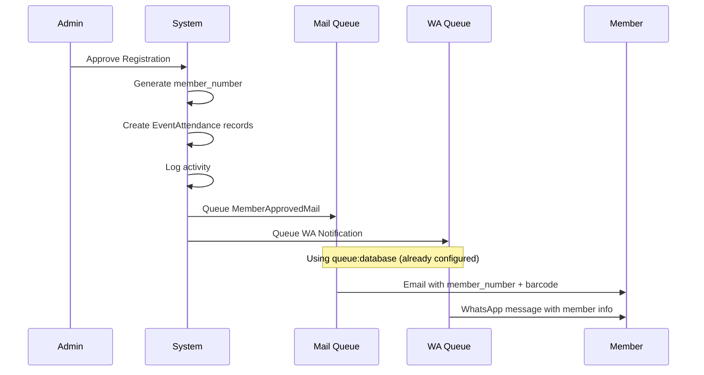

# Implementation Plan: AMG Owners Surabaya — Feature Enhancements

## Overview

Implementing 5 features (Fitur #2, #4, #6, #8, and discuss #7) for the AMG Owners Surabaya system.

---

## Feature #2: Export Absensi per Acara (Excel)

### Description
Download rekap kehadiran untuk setiap acara dalam format Excel (.xlsx). Sama seperti export registrasi yang sudah ada, tapi khusus per event.

### Files Affected

| File | Action | Description |
|------|--------|-------------|
| `app/Exports/AttendanceExport.php` | **CREATE** | New export class for event attendance |
| `app/Http/Controllers/Admin/EventController.php` | **MODIFY** | Add `exportAttendance()` method |
| `resources/views/admin/events/show.blade.php` | **MODIFY** | Add "Export Excel" button |
| `routes/web.php` | **MODIFY** | Add export route |

### Detailed Spec

**`app/Exports/AttendanceExport.php`**
- Implement `FromCollection`, `WithHeadings`, `WithMapping`
- Accept `$eventId` in constructor
- Query: `EventAttendance::with('registration')->where('event_id', $eventId)->get()`
- Headings: No. Member, Nama Lengkap, No. HP, Status, Waktu Scan
- Collection mapping: extract member data from registration relation

**EventController** — new method:
```php
public function exportAttendance(Event $event)
{
    return Excel::download(
        new AttendanceExport($event->id),
        'absensi-'.Str::slug($event->title).'.xlsx'
    );
}
```

**Route:**
```php
Route::get('/events/{event}/export-attendance', [EventController::class, 'exportAttendance']);
```

**Button in `show.blade.php`:** Add next to the "Buka Halaman Scan" button area.

---

## Feature #4: Filter Registrasi Lengkap

### Description
Menambahkan kemampuan filter pada halaman daftar registrasi:
1. Filter dropdown by `membership_status` (All / Pending / Approved / Rejected)
2. Search by `member_number` (in addition to existing name/phone/license_plate)

### Files Affected

| File | Action | Description |
|------|--------|-------------|
| `app/Http/Controllers/Admin/RegistrationController.php` | **MODIFY** | Update `index()` query logic |
| `resources/views/admin/registrations/index.blade.php` | **MODIFY** | Add filter UI above table |

### Detailed Spec

**Controller** — modify `index()`:
```php
$query = Registration::query();

// Existing keyword search (name, phone, plate)
if ($request->filled('keyword')) {
    $keyword = $request->keyword;
    $query->where(function ($q) use ($keyword) {
        $q->where('full_name', 'like', "%{$keyword}%")
          ->orWhere('phone', 'like', "%{$keyword}%")
          ->orWhere('license_plate', 'like', "%{$keyword}%")
          ->orWhere('member_number', 'like', "%{$keyword}%");
    });
}

// NEW: Filter by membership_status
if ($request->filled('status')) {
    $query->where('membership_status', $request->status);
}

$registrations = $query->latest()->get();
```

**View** — add filter bar before table:
- Status dropdown: All, Pending, Approved, Rejected
- Pass `$status` and `$keyword` to view to retain selected values
- Style consistent with existing theme

---

## Feature #6: Batch Approve/Reject Registrasi

### Description
Admin dapat memilih multiple registrations menggunakan checkbox, lalu mengubah status mereka secara massal (Approve/Reject/Pending) dengan satu klik.

### Files Affected

| File | Action | Description |
|------|--------|-------------|
| `app/Http/Controllers/Admin/RegistrationController.php` | **MODIFY** | Add `batchUpdate()` method |
| `resources/views/admin/registrations/index.blade.php` | **MODIFY** | Add checkboxes + batch action buttons |
| `routes/web.php` | **MODIFY** | Add batch route |

### Detailed Spec

**Controller** — new method:
```php
public function batchUpdate(Request $request)
{
    $request->validate([
        'ids' => 'required|array',
        'ids.*' => 'exists:registrations,id',
        'action' => 'required|in:approve,reject,pending',
    ]);

    $statusMap = [
        'approve' => 'Approved',
        'reject' => 'Rejected',
        'pending' => 'Pending',
    ];

    $newStatus = $statusMap[$request->action];
    $count = 0;

    foreach ($request->ids as $id) {
        $registration = Registration::findOrFail($id);
        $registration->update(['membership_status' => $newStatus]);

        // If approving, generate member_number & auto-add to active events
        if ($newStatus === 'Approved' && !$registration->member_number) {
            $registration->member_number = Registration::generateMemberNumber($registration->id);
            $registration->save();

            $activeEvents = Event::whereIn('status', ['upcoming', 'ongoing'])->get();
            foreach ($activeEvents as $event) {
                EventAttendance::firstOrCreate([
                    'event_id' => $event->id,
                    'registration_id' => $registration->id,
                ], ['status' => 'tidak_hadir']);
            }
        }

        $count++;
    }

    ActivityLog::create([
        'user_id' => auth()->id(),
        'activity' => "Batch update {$count} registrasi menjadi {$newStatus}",
        'ip_address' => $request->ip(),
    ]);

    return redirect()->back()->with('success', "{$count} data berhasil diperbarui.");
}
```

**Route:**
```php
Route::post('/registrations/batch-update', [AdminRegistrationController::class, 'batchUpdate']);
```

**View** — modifications:
- Add checkbox `<input type="checkbox" name="ids[]" value="{{ $registration->id }}">` as first column in table
- Add "Select All" checkbox in header
- Add action buttons bar: "Setujui Terpilih", "Tolak Terpilih", "Pending-kan Terpilih"
- Use JavaScript to handle select-all and form submission
- Wrap table in a `<form method="POST" action="/admin/registrations/batch-update">`

**JavaScript behavior:**
```javascript
// Select all checkbox
document.getElementById('selectAll').addEventListener('change', function() {
    document.querySelectorAll('input[name="ids[]"]').forEach(cb => cb.checked = this.checked);
});

// Batch action buttons
document.querySelectorAll('.batch-action-btn').forEach(btn => {
    btn.addEventListener('click', function() {
        const checked = document.querySelectorAll('input[name="ids[]"]:checked');
        if (checked.length === 0) {
            alert('Pilih minimal satu data.');
            return;
        }
        document.getElementById('batchAction').value = this.dataset.action;
        document.getElementById('batchForm').submit();
    });
});
```

---

## Feature #8: Manajemen Status Acara Otomatis

### Description
Artisan command yang berjalan via scheduler untuk otomatis mengupdate status event berdasarkan tanggal:
- Jika `event_date` sudah lewat (<= now) dan status `upcoming` → ubah ke `ongoing`
- Jika `event_date` + duration (default: 1 hari) sudah lewat dan status `ongoing` → ubah ke `completed`
- Events dengan status `cancelled` tidak terpengaruh

### Files Affected

| File | Action | Description |
|------|--------|-------------|
| `app/Console/Commands/UpdateEventStatus.php` | **CREATE** | New Artisan command |
| `routes/console.php` | **MODIFY** | Register scheduler task |

### Detailed Spec

**Artisan Command:**
```php
// app/Console/Commands/UpdateEventStatus.php
namespace App\Console\Commands;

use App\Models\Event;
use Carbon\Carbon;
use Illuminate\Console\Command;

class UpdateEventStatus extends Command
{
    protected $signature = 'events:update-status';
    protected $description = 'Auto-update event status based on event_date';

    public function handle()
    {
        $now = Carbon::now();

        // upcoming → ongoing: if event_date has passed (within last 24h grace period)
        $upcomingCount = Event::where('status', 'upcoming')
            ->where('event_date', '<=', $now)
            ->update(['status' => 'ongoing']);

        // ongoing → completed: if event_date + 1 day has passed
        $ongoingCount = Event::where('status', 'ongoing')
            ->where('event_date', '<=', $now->copy()->subDay())
            ->update(['status' => 'completed']);

        $this->info("Updated {$upcomingCount} events to ongoing, {$ongoingCount} to completed.");
    }
}
```

**Scheduler in `routes/console.php`:**
```php
use Illuminate\Support\Facades\Schedule;

Schedule::command('events:update-status')->everyMinute();
// or ->hourly() for production
```

**Also register command in `bootstrap/app.php`** if using Laravel 11+ with manual command registration, or place in `app/Console/Commands/` directory which is auto-discovered.

---

## Feature #7: Notifikasi Member Approve — Design Discussion

### Concept
Saat admin menyetujui registrasi (status → Approved), system secara otomatis mengirim notifikasi ke member yang bersangkutan.

### Channels Options

| Channel | Pros | Cons |
|---------|------|------|
| **Email** | Built-in Laravel Mail; no 3rd party dependency | Member mungkin jarang cek email |
| **WhatsApp** | High engagement; fast delivery | Need 3rd party API (Fonnte/WATI/ Twilio) |
| **SMS** | Universal | Biaya per SMS |
| **Both (Email + WA)** | Maximum reach | More complex implementation |

### Recommended Flow



### Mail Solution (Built-in, No Extra Cost)

Using Laravel's built-in Mail system + Mailhog for dev:

1. **Create Mailable** — `app/Mail/MemberApproved.php`
2. **Create Notification** — `app/Notifications/MemberApproved.php` (optional, can use Mail facade directly)
3. **Queue the email** using the existing `QUEUE_CONNECTION=database`
4. **Markdown email template** with:
   - Welcome message
   - Member number (AMGxxxxx)
   - Barcode image (inline base64)
   - Brief instructions for events

5. **Trigger** — in `RegistrationController@update` and `batchUpdate` when status changes to Approved

### WhatsApp Solution (Requires 3rd Party)

Recommended providers for Indonesia:
- **Fonnte** ([fonnte.com](https://fonnte.com)) — Popular in Indonesia, REST API, affordable
- **WATI** ([wati.io](https://wati.io)) — Good for business
- **Twilio** — Global, but more expensive

Implementation approach:
```php
// app/Services/WhatsAppService.php
class WhatsAppService
{
    public function send(string $phone, string $message): void
    {
        // HTTP POST to provider's API
    }
}
```

### Data Flow for Feature #7

```
Registration Approved
  ├── Generate member_number (existing logic)
  ├── Auto-add to active events (existing logic)
  ├── Activity Log (existing logic)
  ├── NEW: Queue email notification
  │     ├── To: member's email
  │     ├── Subject: "Selamat! Pendaftaran Anda Disetujui - AMG Owners Surabaya"
  │     ├── Content: member_number, barcode, welcome message
  │     └── Barcode image embedded
  └── OPTIONAL: Queue WhatsApp notification
        ├── To: member's phone
        ├── Template: "Halo {nama}, pendaftaran Anda disetujui! Nomor member: {nomor}"
        └── Send via external API
```

---

## Summary of All Routes to Add

```php
// Feature #2 - Export Attendance
Route::get('/events/{event}/export-attendance', [EventController::class, 'exportAttendance']);

// Feature #6 - Batch Update
Route::post('/registrations/batch-update', [AdminRegistrationController::class, 'batchUpdate']);
```

## Implementation Order

1. **Feature #4** — Filter Registrasi (minor controller + view change)
2. **Feature #6** — Batch Approve/Reject (controller + view + route)
3. **Feature #2** — Export Absensi (new export class + controller + view + route)
4. **Feature #8** — Auto Status (new command + scheduler)
5. **Feature #7** — Notifications (pending design approval)
