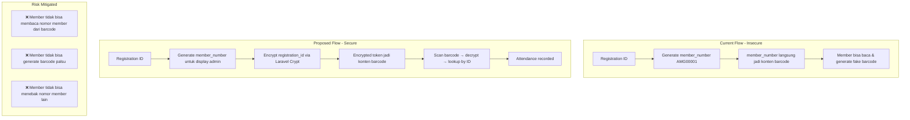
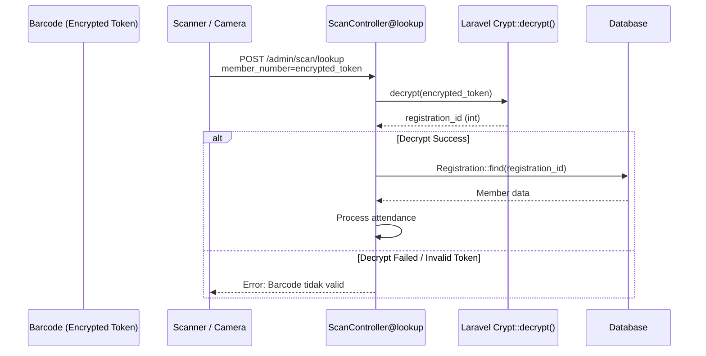
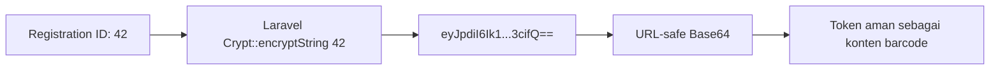

# Plan: Secure Barcode Encryption

## Latar Belakang

Saat ini, barcode member berisi **raw `member_number`** (contoh: `AMG00001`) yang bersifat **predictable** dan **sequential**. Karena formatnya diketahui publik (`AMG` + nomor urut), member dapat:

1. Membaca langsung nilai barcode
2. Menebak nomor member lain dengan increment
3. **Generate barcode palsu** secara manual menggunakan barcode generator online
4. Membagikan barcode ke non-member untuk absensi ilegal

## Solusi: Encrypt Registration ID ke dalam Barcode

Gunakan **Laravel Crypt** (AES-256-CBC) untuk mengenkripsi `registration_id` menjadi token aman yang digunakan sebagai konten barcode. Hanya server dengan `APP_KEY` yang dapat mendekripsi token.

### Mengapa Enkripsi (bukan Random Token)?

| Kriteria | Enkripsi (Approach 1) | Random Token (Approach 2) |
|----------|----------------------|--------------------------|
| Schema change | ❌ Tidak perlu | ✅ Perlu migration + kolom baru |
| Key management | ✅ Pakai APP_KEY existing | ❌ Tidak relevan |
| Reversibility | ✅ Langsung decrypt | ✅ Langsung query |
| Revoke token | ❌ Butuh ganti APP_KEY | ✅ Bisa update kolom |
| Barcode length | ~60-80 karakter | ~16-32 karakter |

Keduanya valid. Saya rekomendasikan **Enkripsi** karena **zero schema change** dan memanfaatkan **APP_KEY** yang sudah ada. Jika panjang barcode menjadi masalah, bisa migrasi ke Random Token di fase berikutnya.

---

## Arsitektur



## Data Flow: Scan dengan Barcode Terenkripsi



## Key Generation: Encrypted Barcode Token



URL-safe Base64: replace `+` → `-`, `/` → `_`, trim `=`

---

## File yang Diubah

### 1. [`app/Services/BarcodeService.php`](app/Services/BarcodeService.php) — **NEW**
Service class dengan dua static method:
- `encrypt(int $registrationId): string` — Encrypt + encode ke URL-safe string
- `decrypt(string $token): ?int` — Decode + decrypt, return registration ID atau null

### 2. [`app/Http/Controllers/Admin/ScanController.php`](app/Http/Controllers/Admin/ScanController.php:29) — **MODIFY**
**Method `lookup()`:**
- Terima input `member_number` (bisa raw token atau encrypted token)
- Coba decrypt input sebagai token
  - Jika berhasil → cari Registration by ID hasil decrypt
  - Jika gagal → fallback cari berdasarkan `member_number` (untuk backward compatibility)
- Update response error message

### 3. [`app/Http/Controllers/Admin/RegistrationController.php`](app/Http/Controllers/Admin/RegistrationController.php:286) — **MODIFY**
**Method `exportBarcodes()`:**
- Gunakan `BarcodeService::encrypt($member->id)` sebagai konten barcode
- Nama file PNG tetap pakai `member_number` untuk identifikasi admin

### 4. [`resources/views/admin/registrations/show.blade.php`](resources/views/admin/registrations/show.blade.php:222) — **MODIFY**
**Barcode Card section (~line 207-283):**
- Gunakan `BarcodeService::encrypt($registration->id)` sebagai konten barcode
- Tampilkan `member_number` tetap di bawah barcode untuk identifikasi visual
- Barcode image menghasilkan token terenkripsi, bukan raw member_number

### 5. [`resources/views/admin/scan/index.blade.php`](resources/views/admin/scan/index.blade.php) — **MODIFY**
- Update placeholder text untuk menjelaskan bahwa input bisa berupa hasil scan barcode (encrypted token)

---

## Detail Implementasi

### `app/Services/BarcodeService.php`

```php
<?php

namespace App\Services;

use Illuminate\Support\Facades\Crypt;

class BarcodeService
{
    /**
     * Encrypt registration ID into a URL-safe barcode token.
     */
    public static function encrypt(int $registrationId): string
    {
        $encrypted = Crypt::encryptString((string) $registrationId);
        
        // Convert to URL-safe base64
        $safe = str_replace(['+', '/', '='], ['-', '_', ''], $encrypted);
        
        return $safe;
    }

    /**
     * Decrypt a barcode token back to registration ID.
     * Returns null if token is invalid.
     */
    public static function decrypt(string $token): ?int
    {
        try {
            // Restore original base64
            $original = str_replace(['-', '_'], ['+', '/'], $token);
            
            $decrypted = Crypt::decryptString($original);
            
            return (int) $decrypted;
        } catch (\Exception $e) {
            return null;
        }
    }
}
```

### `ScanController@lookup` — Modified Logic

```php
public function lookup(Request $request)
{
    $request->validate([
        'member_number' => 'required|string|max:255',
    ]);

    $input = $request->member_number;
    $member = null;

    // Try to decrypt as barcode token first
    $registrationId = BarcodeService::decrypt($input);
    
    if ($registrationId) {
        $member = Registration::find($registrationId);
    }

    // Fallback: look up by raw member_number (backward compat)
    if (! $member) {
        $member = Registration::where('member_number', $input)->first();
    }

    if (! $member) {
        return redirect()
            ->back()
            ->with('error', 'Member dengan barcode tersebut tidak ditemukan.');
    }

    // ... rest of the logic unchanged
}
```

---

## Backward Compatibility

- **Existing barcodes** yang belum di-reprint akan tetap bisa di-scan melalui **fallback lookup** by `member_number`
- **Hanya barcode baru** (yang di-generate setelah implementasi) yang menggunakan encrypted token
- Admin tetap bisa melihat/mencari `member_number` di halaman admin
- Export barcode ZIP akan berisi barcode dengan token terenkripsi

## Keamanan

- **APP_KEY** di `.env` adalah kunci enkripsi — jika berubah, semua barcode lama tidak bisa di-decode
- Encrypted token tidak bisa di-decode tanpa APP_KEY
- Token bersifat **tidak predictable** — tidak sequential seperti `AMG00001`
- Format token adalah alphanumeric (A-Z, a-z, 0-9, `-`, `_`) — aman untuk barcode Code 128

## Risiko & Mitigasi

| Risiko | Mitigasi |
|--------|----------|
| APP_KEY berubah → semua barcode invalid | Backup APP_KEY; warning di activity log |
| Encrypted token terlalu panjang | Code 128 support variable length; test dengan ID tertinggi |
| Scanner tidak membaca karakter `-` atau `_` | Code 128 support full ASCII; fallback lookup tersedia |
| Performa decrypt per scan | Decrypt sangat cepat (<1ms); tidak ada overhead berarti |
