# Plan: Secure Barcode — Random Token Approach (v2)

## Problem

Pendekatan enkripsi (v1) menghasilkan token **200 karakter** — terlalu panjang untuk barcode Code 128 yang praktis di-scan kamera.

## Solution: Random Barcode Token

Ganti ke pendekatan **Random Token**: tambahkan kolom `barcode_token` (VARCHAR 32, unique, indexed) di tabel `registrations`, isi dengan random alphanumeric 16 karakter.

| Criteria | Enkripsi (v1 — gagal) | Random Token (v2) |
|----------|----------------------|-------------------|
| Barcode length | ~200 chars ❌ | 16 chars ✅ |
| Schema change | Tidak | Migration ✅ |
| Lookup | Decrypt → find by ID | Direct WHERE barcode_token ✅ |
| Aman? | ✅ AES-256 | ✅ Random, unpredictable |
| Backward compat | Fallback member_number | Fallback member_number |

## Arsitektur

```mermaid
flowchart TD
    subgraph Database[Schema Change]
        A[Migration: add barcode_token to registrations] --> B[Generate random 16-char token<br/>for each approved member]
        B --> C[Index on barcode_token for fast lookup]
    end

    subgraph BarcodeFlow[Barcode Generation - New]
        D[Member approved] --> E[Generate random token]
        E --> F[Save to barcode_token column]
        F --> G[Token jadi konten barcode]
    end

    subgraph ScanFlow[Scanning - New]
        H[Scan barcode] --> I[Lookup by barcode_token]
        I --> J[Found?]
        J -- Yes --> K[Process attendance]
        J -- No --> L[Fallback: lookup by member_number]
        L --> M[Found?]
        M -- Yes --> K
        M -- No --> N[Error: not found]
    end
```



## File yang Diubah

### 1. Database Migration — **NEW**
- File: [`database/migrations/2026_07_08_000001_add_barcode_token_to_registrations_table.php`](database/migrations/)
- Tambah kolom `barcode_token` varchar(32) unique nullable
- Tambah index
- Generate token untuk semua approved member yang sudah ada

### 2. [`app/Services/BarcodeService.php`](app/Services/BarcodeService.php) — **REWRITE**
Hapus method encrypt/decrypt, ganti dengan:
- `generateToken(): string` — random 16-char alphanumeric
- `generateForExistingMembers(): int` — backfill token untuk member existing

### 3. [`app/Models/Registration.php`](app/Models/Registration.php) — **MODIFY**
- Tambah `$fillable` = `barcode_token`
- Method `generateBarcodeToken()` — generate & simpan token

### 4. [`app/Http/Controllers/Admin/ScanController.php`](app/Http/Controllers/Admin/ScanController.php:29) — **MODIFY**
- `lookup()` — cari berdasarkan `barcode_token` dulu, fallback `member_number`

### 5. [`app/Http/Controllers/Admin/RegistrationController.php`](app/Http/Controllers/Admin/RegistrationController.php) — **MODIFY**
- `update()` — saat approve, generate `barcode_token`
- `batchUpdate()` — saat approve, generate `barcode_token`
- `exportBarcodes()` — konten barcode pakai `$member->barcode_token`

### 6. [`resources/views/admin/registrations/show.blade.php`](resources/views/admin/registrations/show.blade.php:222) — **MODIFY**
- Barcode image pakai `$registration->barcode_token`

### 7. [`resources/views/admin/scan/index.blade.php`](resources/views/admin/scan/index.blade.php) — **MODIFY**
- Update placeholder (sama seperti v1)

## Detail Token

```php
public static function generateToken(): string
{
    $chars = 'ABCDEFGHIJKLMNOPQRSTUVWXYZabcdefghijklmnopqrstuvwxyz0123456789';
    $token = '';
    for ($i = 0; $i < 16; $i++) {
        $token .= $chars[random_int(0, strlen($chars) - 1)];
    }
    return $token;
}
```

Contoh token: `X7kM9pQ2rT5vW3nA` — 16 karakter, alphanumeric, unpredictable.

## Migration: Backfill Token untuk Member Existing

Migration akan:
1. Tambah kolom `barcode_token`
2. Loop semua registrasi dengan `member_number IS NOT NULL`
3. Generate & simpan token unik untuk masing-masing

## Backward Compatibility

Sama seperti v1 — `ScanController@lookup` tetap punya fallback:
1. Cari by `barcode_token` → jika ketemu, proses
2. Fallback: cari by `member_number` → jika ketemu, proses
3. Tidak ditemukan → error

## Test yang Akan Dilakukan

1. **Generate token** → 16 chars, alphanumeric ✅
2. **Unique constraint** → tidak ada duplikat ✅
3. **Scan token** → lookup by token, ditemukan ✅
4. **Scan member_number lama** → fallback, ditemukan ✅
5. **Scan token palsu** → tidak ditemukan ✅
